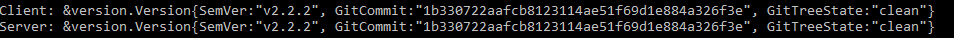
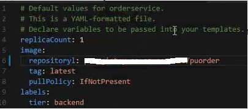
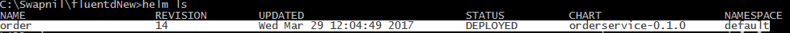

# Deploy Parts Unlimited MRP on Azure Container Service with Kubernetes

Setting up Kubernetes

In this lab, will learn how to setup Kubernetes using a new Azure
Container Services (ACS) and then deploy the Parts Unlimited MRP web
application on this infrastructure using Helm.

## Prerequisites

- Fundamental knowledge of how to use git version control.
- Create an Azure Container Registry (ACR) account. To understand how
    to create, [see
    here](https://docs.microsoft.com/azure/container-registry/container-registry-get-started-portal). Note:
    Other docker registries are supported, but steps given in this
    article will be a reference to ACR only.

## The following workflow is to be followed:

1. Setup ACS Kubernetes Cluster
1. Create DocumentDB and use DocumentDB api for MongoDB
1. Build and Push Docker Container to ACR
1. Install and Setup Helm
1. Create Helm charts
1. Deploy Parts Unlimited MRP using Helm


## 1. Setup ACS Kubernetes Cluster

Create Kubernetes cluster using Azure container service cluster and connect to Kubernetes cluster

1. Follow [Create and connect to Kubernetes cluster](https://docs.microsoft.com/azure/container-service/container-service-kubernetes-walkthrough) document to create an ACS Kubernetes Cluster.

    The following screenshots and steps are provided for reference with respect to Parts Unlimited MRP project deployment.

    ```bash
    # Create Azure Resource group
    az group create --name=kube-res --location=eastasia

    # Create Kubernetes cluster

    az acs create --orchestrator-type=kubernetes --resource-group=kube-res --name=kube-container --dns-prefix=kube --agent-count=2
    ```
    
    *The script, while running will have a black screen and would take several minutes to complete. On completion, the script output should be similar to the above. If desired, check in Azure portal while the script is running to see resources being created. The above command creates a cluster named “kube-container” under “kube-res” resource group with two agents and one master.*

1. Check connectivity to the newly created ACS cluster by running

    ```bash
    kubectl cluster-info
    ```

    
    The above output tells that the local kubectl is able to communicate successfully with the kubernetes cluster. For more information or troubleshooting, see [Connect to an Azure Container Service cluster](https://docs.microsoft.com/en-us/azure/container-service/container-service-connect) and [using the Kubernetes web UI with Azure Container Service](https://docs.microsoft.com/en-us/azure/container-service/container-service-kubernetes-ui).

## 2.  Create DocumentDB and use DocumentDB api for MongoDB

This lab uses DocumentDB database as the data store and uses MongoDB connection string to connect to it.

[Follow the steps in this website](https://docs.microsoft.com/en-us/azure/documentdb/documentdb-connect-mongodb-account) which walks through the setup steps for DocumentDB and obtaining the MongoDB connection string.

## 3.  Build the Docker Image and push to Azure Container Registry

The code needs to be containerized using Docker in order to eventually be able to be deployed to a Kubernetes cluster.
How to dockerize your application is beyond the scope of this post, but check out this article on [dockerizing the Parts Unlimited MRP application](https://microsoft.github.io/PartsUnlimitedMRP/adv/adv-21-Docker.html) and also included the [Dockerfile to be used.](https://dxdevop.visualstudio.com/mrpmicro/_git/code?fullScreen=false&path=%2Fdeploy%2Fdocker%2FOrder%2FDockerfile&version=GBmaster&_a=contents)

1. Clone the Parts Unlimited [repository](https://dxdevop.visualstudio.com/mrpmicro/_git/code).
1. Login to Docker Registry and Build the Docker Image

    Navigate to the Order service Dockerfile on the cloned repository under deploy/docker/Order path, replace the `puregistry-on` name with the provisioned name from the prerequisite steps, and execute below commands:

    ```bash
    docker login puregistry-on.azurecr.io –u puagent –p password \
    docker build --build-arg port=8080 --build-arg mongo_connection=<Mongo Db connection string> -t
        puregistry-on.azurecr.io/puorder:v1.0 .
    ```
    The mentioned command builds an image based on the current directory:
    - The image name must match the URL of ACR, that is,
        myownname-on.azurecr.io/mypathtoorganize/imagename.\
        The dot at the end tells Docker build to look at current folder
        for Docker file
    - This command takes port on which the service will be exposed and
        mongo db connection string as an argument.
    - Kubernetes works well if the EXPOSE command is present in the
        Dockerfile for necessary communication ports the app requires to
        function.

1. Push the Docker image to ACR

    Replace the name of puregistry with the ACR name created in the prequisite steps and execute.
    ```bash
    Docker push puregistry-on.azurecr.io/puorder:v1.0
    ```

    For More Info on docker registry, please follow the following
    [document](https://docs.microsoft.com/en-us/azure/container-registry/container-registry-get-started-docker-cli).

## 4.  Install and Setup Helm

Helm is a tool for managing Kubernetes charts. Charts are packages of pre-configured Kubernetes resources. A quick walkthrough on helm is available at: <https://github.com/kubernetes/helm>.

1. Install Helm

    **For Windows**

    - Download the [required version](https://github.com/kubernetes/helm/releases)
    - Unpack it by right clicking “helm-v2.2.3-windows-amd64.zip” file and extract to helm-v2.2.3-windows-amd64/
    - Find the helm binary in the unpacked directory, and move it to its desired destination

    **For Linux and OSX**

    Helm has an installer script that will automatically grab the latest version of the Helm client and [install it locally](https://raw.githubusercontent.com/kubernetes/helm/master/scripts/get)

    ```bash
    curl https://raw.githubusercontent.com/kubernetes/helm/master/scripts/get/_helm.sh
    chmod 700 get\_helm.sh
    ./get\_helm.sh
    ```

    Simply type `helm` to ensure helm is properly installed.  Helm should be installed path as system variable in environment variable

    The [installation guide](https://github.com/kubernetes/helm/blob/master/docs/install.md) is provided for reference.

1. Set up Helm

    Once Helm is installed locally, initialize the local CLI and install Tiller to the Kubernetes cluster in one step:

    `helm init`

    

    The command will install Tiller into the Kubernetes cluster created in step 1

    The “Initialize Helm and Install Tiller” section is [here](https://github.com/kubernetes/helm/blob/master/docs/quickstart.md) for reference. To ensure Helm is installed locally and on the cluster run:

    `helm version`

    

## 5.  Create Helm charts for MRP unlimited

> Helm uses a packaging format called charts. A chart is a collection of
> files which describes a related set of Kubernetes resources. These
> charts are used for deploying something simple, like a pod, or
> something complex, like a full web app stack with HTTP servers,
> databases, and caches.
>
> The following command creates a blank helm chart template*.* This
> command has already been completed and populated with specific
> information to be able to deploy the order service to the kubernetes
> cluster.

*helm create orderservice --name orderservice*

> **Chart file structure **
>
> A chart is an organized collection of files inside a directory. The
> directory name is the name of the chart. For example, a chart
> describing orderservice would be stored in the orderservice directory.
>
> Inside this directory, Helm will expect a structure that matches the
> following structure:
>
> \$ orderservice
>
> ├── Charts.yaml
>
> ├── values.yaml
>
> ├── templates
>
> │ ├── \_helper.tpl
>
> │ ├── deployment.yaml
>
> │ ├── Notes.txt
>
> │ └── service.yaml
>
> Let us quickly go through the functionality of each of the file and
> folder:
>
> **Templates(folder)**: A directory of templates, when combined with
> values, will generate valid Kubernetes manifest files.
>
> **Charts.yaml:** It’s a YAML file containing information about the
> chart. These settings may include:

-   apiVersion: It is version of helm.


-   description: It provides a single line description of this project.

-   Name: Name of the chart (upper case character is not allowed in
    name).

-   Version: Every chart must have a version number. A version must
    follow the http://semver.org/[SemVer 2](http://semver.org/)
    standard. Kubernetes Helm uses version numbers as release markers.
    Packages in repositories are identified by name plus version.[SemVer
    2](http://semver.org/) standard.

-   sources: A list of URLs to source code for this project (optional).

-   maintainers: \# (optional)


-   name: The maintainer's name (required for each maintainer).

-   email: The maintainer's email (optional for each maintainer).


-   engine: gotpl \# The name of the template engine (optional, defaults
    to gotpl).

> **values.yaml**: It declare variables to be passed into templates.
> Helm updates any service using this file’s values. It contains the
> following fields for use:

-   replicaCount: How many replica counts of service you want

-   image: The Image file to be used for deployment

-   repository: Your private Docker registry/folder name of Docker image
    for service

-   tag: latest

-   pullPolicy: IfNotPresent


-   service:


-   name: Name of micro service

-   type: mention if it is using ClusterIP or load balancer.

-   portName: http

-   externalPort: external port number

-   internalPort: internal port number

-   imagePullSecrets\*\*: puregistrykey (This is a custom parameter. The
    private Docker registry must be mentioned where images are located
    for the micro services. This is required for deployment. Also, this
    parameter will be again used by deployment.yaml (more details below)
    and services.yaml(more details below) file during deployment.)\
    \
    To create a Pull secret key, run the following command:\
    \
    *kubectl create secret docker-registry puregistrykey
    --docker-server=https://puregistry-on.azurecr.io
    --docker-username=ACR\_USERNAME --docker-password=ACR\_PASSWORD
    --docker-email=ANY\_EMAIL\_ADDRESS*


-   Resources: These resources values are by default present when the
    chart is created and can be updated if needed depending on the
    needs.

> cpu: 100m
>
> memory: 128Mi

-   Requests: These resources values are by default present when the
    chart is created and can be updated if needed depending on the
    needs.

> cpu: 100m
>
> memory: 128Mi
>
> **\_helper.tpl**: (optional) This file can be used to have default
> fully qualified app names.
>
> **Deployment.yaml**: This file refers to values.yaml and overwrites
> values mentioned in values.yaml. Helm provides a default structure for
> this file and can update the values accordingly.
>
> Example: In deployment.yaml, see the following field:
>
> replicas: {{ .Values.replicaCount }}
>
> Now **Values.replicaCount** will get values from values.yaml file
> replicaCount parameter which will be used in deployment of service.
>
> **Notes.txt**: A plain text file containing short usage notes
>
> **Services.yaml**: same as deployment.yaml.
>
> Refer to [using helm to manage
> charts](https://github.com/kubernetes/helm/blob/master/docs/charts.md#using-helm-to-manage-charts)
> for more information.

## 6. Deploy Parts Unlimited MRP using Helm

> Once the Helm charts are ready using above command, run the following
> Helm install command to deploy microservices. Make sure the command
> path is in same location where all the charts are.
>
> *helm install orderservice --name=order --set image.tag=v1.0*
>
> 
>
> To check if service is deployed use the following command:
>
> *helm list*
>
> 
>
> In above example, Order micro service is deployed manually. Please
> follow the same steps and deploy all the remaining microservices
> namely catalog, dealer, shipment, quote services also before moving to
> CI/CD with VSTS HOL.
>
> \`\`\`
>
> *helm install dealerservice --name=dealer --set image.tag=v1.0*
>
> *helm install shipmentservice --name=shipment --set image.tag=v1.0*
>
> *helm install quoteservice --name=quote --set image.tag=v1.0*
>
> \`\`\`
>
> **Note:** It is possible to combine create and install/deployment of
> these microservices as best practice for a CI/CD pipeline is to enable
> independent deployment pipelines.
>
> At any point of time if there is any syntax error in any of the
> \*.yaml file then helm command would fail giving an exception.
>
> Example: If there is a spelling mistake in the yaml file, then while
> trying to deploy it will create an error as shown:
>
> 
>
> 

Conclusion:

This document covers how to setup Kubernetes followed by installing Helm
on it. We also discussed how to create helm charts and how to deploy the
Parts Unlimited MRP Order micro services using Helm.\
Running the below command will list down all the deployments created on
the kubernetes cluster under this lab.\
*helm ls\
*\


Useful helm commands:

-   ***helm ls**: Shows all running deployments.*

-   ***helm ls -- all**: Shows all the running, failed deployments.*

-   ***helm upgrade &lt;chartname&gt;:** To upgrade any service (ex:
    replicas parameter in any service) in deployment. Also, on reverting
    the changes and running this command again it will roll back the
    changes.*

-   ***helm delete &lt;chartname&gt;:** Delete deployment.*

-   ***helm lint &lt;chartname&gt;:** Verifies that chart is valid and
    meeting the standard.*

-   ***helm install &lt;chartname&gt; -- name: &lt;testname&gt; -
    -dry-run**: To perform dry run before installing deployment.*
