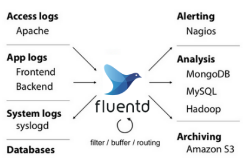
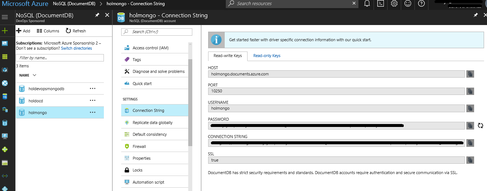
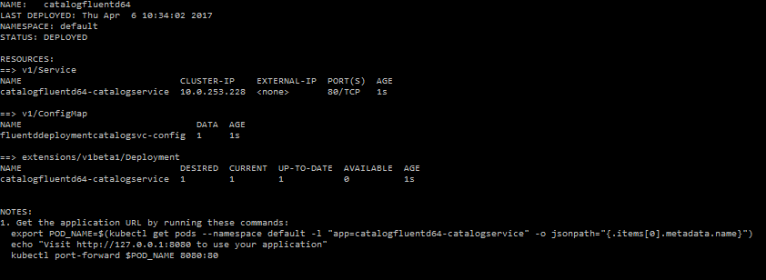
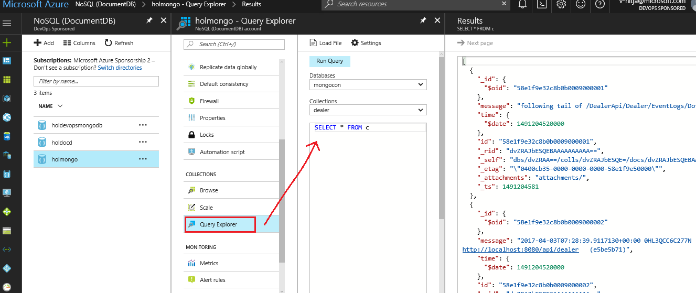

# **Implementing Fluentd on Helm Kubernetes infrastructure**

 In this lab, learn how to setup [Fluentd](http://www.fluentd.org/), an open source data collector, which unifies the data collection and consumption for a better use and understanding of data. This layer allows developers and data analysts to utilize many types of logs as they are generated.

> 

## Prerequisites

- Kubernetes setup with helm installed.
- Familiarity with Docker, Azure Container Registry (ACR), Azure
    Container Service (ACS). Follow
    [HOL1](https://dxdevop.visualstudio.com/mrpmicro/_git/docs?path=%2FHOL1%2FHOL1_readme.md)
    for more details.
- Completion of
    [HOL1](https://dxdevop.visualstudio.com/mrpmicro/_git/docs?path=%2FHOL1%2FHOL1_readme.md)
    or
    [HOL2](https://dxdevop.visualstudio.com/mrpmicro/_git/docs?path=%2FHOL2%2FHOL2_readme.md)
- Parts Unlimited MRP cloned to local drive using the VSTS credentials

## This is the workflow to follow:

1. Using Sidecar approach with Fluentd
1. Using Daemonset approach with Fluentd
1. Using Fluentd for logging application and other logs

## 1\. Using Sidecar approach with Fluentd


In this approach, the sidecar container runs fluentd as a logging agent,
which is configured to pick up logs from an application container. This
lab references application logs created by parts Unlimited MPR
microservices. So, need to update the Helm charts of Parts Unlimited MPR
microservices (From HOL 1, 2) with an additional container of Fluentd.

This HOL will refer to dealer service which is part of the Parts
Unlimited MRP repository clone. Navigate to
\~/deploy/helm/individual/fluentd/sidecar to check the sample helm chart
referred in this HOL.
### Deployment.yaml

This file contains the references to the Fluentd, Service image and to
the configurations associated with them.

Following keys are used to describe the yaml

1.  image: Docker image location that can be referenced. This HOL uses
    the Dealer API image created using HOL 1 and the following fluentd
    image: gcr.io/google\_containers/fluentd-gcp:1.30

2.  args: allowed arguments with the given image

3.  containerPort: the TCP port via which the container is available

4.  volumeMount: has the description of various mountPaths along with
    its name

5.  mountPath: the physical location where the files will be stored on
    docker. For Dealer API, the mountPath is
    /DealerApi/Dealer/EventLogs/ where logs are getting generated.

6.  Volumes: Simply a directory on disk or in another container. The
    name of the volume should be same as the name of mounthPath (which
    is varlog in this HOL), and should be same across the
    deployment.yaml. For the HOL, this Volume takes the logs from
    container and exposes it at POD level so that both fluentd sidecar
    and container can access it.


Referring the Helm chart of microservices in HOL1 and adding the
below highlighted part for container of Fluentd with mount path of
Application logs.

The highlighted part which states the mount path for logs of
application and the config which should be referred for the traces.
```bash
apiVersion: extensions/v1beta1
kind: Deployment
metadata:
  name: {{ template "fullname" . }}
  labels:
    chart: "{{ .Chart.Name }}-{{ .Chart.Version | replace "+" "_" }}"
spec:
  replicas: {{ .Values.replicaCount }}
  template:
    metadata:
      labels:
        app: {{ template "fullname" . }}
        tier: {{ .Values.labels.tier }}
        link: {{ .Values.labels.link }}
    spec:
      containers:
      - name: {{ .Chart.Name }}
        image: "{{ .Values.image.repository }}:{{ .Values.image.tag }}"
        imagePullPolicy: {{ .Values.image.pullPolicy }}
        volumeMounts:
        - name: varlog
          mountPath: /DealerApi/Dealer/EventLogs/
      - name: fluentddealer-agent
        image: gcr.io/google_containers/fluentd-gcp:1.30
        env:
        - name: FLUENTD_ARGS
          value: -c /etc/fluentd-config/fluentd.conf
        volumeMounts:
        - name: varlog
          mountPath: /DealerApi/Dealer/EventLogs/
        - name: config-volume
          mountPath: /etc/fluentd-config
        ports:
        - name: {{ .Values.service.portName }}
          containerPort: {{ .Values.service.internalPort }}
      imagePullSecrets:
      - name: {{ .Values.service.imagePullSecrets }}
      volumes:
      - name: varlog
        emptyDir: {}
      - name: config-volume
        configMap:
          name: fluentddeployment-config
```

### Service.yaml

This file contains the definition for the following configurations
microservice and fluentd.conf file. So need to update the service.yaml
file with the Fluentd configuration to mention the path of file from
where microservice logs need to be fetched and the output which is used
as MongoDB in this lab.

MongoDB connection details could be fetched from azure portal as
mentioned in screenshot below:

For details on how to use Azure DocumentDB API for MongoDB, please refer
the following
[link](https://docs.microsoft.com/en-us/azure/documentdb/documentdb-protocol-mongodb)



```bash
    apiVersion: v1
    kind: Service
    metadata:
    name: {{ template "fullname" . }}
    labels:
    chart: "{{ .Chart.Name }}-{{ .Chart.Version | replace "+" "_" }}"
    spec:
    type: {{ .Values.service.type }}
    ports:
    - port: {{ .Values.service.externalPort }}
    targetPort: {{ .Values.service.portName }}
    protocol: TCP
    name: {{ .Values.service.name }}
    selector:
    app: {{ template "fullname" . }}
    tier: {{ .Values.labels.tier }}
    link: {{ .Values.labels.link }}

    apiVersion: v1
    kind: ConfigMap
    metadata:
    name: fluentddeployment-config
    data:
    fluentd.conf: |
    <source>
        type tail
        format none
        path /DealerApi/Dealer/EventLogs/DotNetAPI_Log.txt
        read_from_head true
        tag count.format2
    </source>
    <match **>
        @type mongo
        host ####.documents.azure.com
        port 10250
        database mongocon #(required)
        collection dealer #(optional; default="untagged")
        user holmongo
        password ***********************
        ssl true
    </match>
```

### Values.yaml

This file contains the values that can be used as configuration
properties, across the yaml files like deployment.yaml, service.yaml.
```bash
replicaCount: 1
image:
  repository: puregistry-on.azurecr.io/pudealer
  tag: latest
  pullPolicy: IfNotPresent
labels:
  tier: backend
  link: PartsUnlimitedMrp
service:
  name: dealer-service
  type: ClusterIP
  portName: http
  externalPort: 80
  internalPort: 8080
  imagePullSecrets: puregistrykey
resources:
  limits:
    cpu: 100m
    memory: 128Mi
  requests:
    cpu: 100m
    memory: 128Mi
```


## 2\. Using Daemonset Approach with fluentd

A DaemonSet ensures that all (or some) nodes run a copy of a pod. As
nodes are added to the cluster, pods are added to them. As nodes are
removed from the cluster, those pods are garbage collected. Deleting a
DaemonSet will clean up the pods it created. This will be used to
collect logs from Pods, Docker, and container.

This HOL will refer to dealer service which is part of the Parts
Unlimited MRP repository clone. Navigate to
\~/deploy/helm/individual/fluentd/daemonset to check the sample helm
chart referred in this HOL.

### Daemonset.yaml

This file contains the references to the Fluentd image and to the
configurations associated with them.

Following keys are used to describe the yaml

1. image: Docker image location that can be referenced. This HOL uses
    the following fluentd image:
    gcr.io/google\_containers/fluentd-gcp:1.30

1. volumeMount: has the description of various mountPaths along with
    its name

1. mountPath : the physical location where the files will be stored,
    should be same as mentioned in the files in repository.

1. volumes: is simply a directory on disk or in another container,
    should be same as mentioned in the files in repository as those
    paths are specific to the location of logs generated by Kubernetes,
    docker and container.


 Referring the helm charts for daemonset no changes need to be done
 except the MongoDB connection. It could be used as it is. On
 installing the helm charts, it would create the pods with the no. of
 nodes available and get the logs of the container, kubernetes and
 docker as per the log files referred in config and insert those to
 MongoDB. Refer the screenshot above for MongoDB connection string.

 ```bash
apiVersion: extensions/v1beta1
kind: DaemonSet
metadata:
  name: fluentddaemon-container
spec:
  selector:
    matchLabels:
      app: fluentd
  template:
    metadata:
      name: fluentd
      labels:
        app: fluentd
    spec:
      containers:
      - name: fluentdjava-agent
        image: gcr.io/google_containers/fluentd-gcp:1.30
        env:
        - name: FLUENTD_ARGS
          value: -c /etc/fluentd-config/fluentd.conf
        volumeMounts:
          - name: kubelet-containers
            mountPath: "/var/log/containers"
          - name: docker-containers
            mountPath: "/var/lib/docker/containers"
          - name: docker
            mountPath: "/var/run/docker.sock"
          - name: config-volume
            mountPath: /etc/fluentd-config
      volumes:
      - name: kubelet-containers
        hostPath:
          path: /var/log/containers
      - name: docker-containers
        hostPath:
          path: /var/lib/docker/containers
      - name: docker
        hostPath:
          path: /var/run/docker.sock
      - name: config-volume
        configMap:
          name: fluentddaemon-config
 ```

### Service.yaml

This file contains the definition for the following configurations of
fluent.conf file to fetch the Kubernetes, container and docker logs.

source: This tag is used to specify details of the data source. This HOL
uses the Source type as tail, which watches files specified under path
attribute. Additional attributes like time\_format, tag, format etc. can
be specified. More details are available on [Official FluentD
docs](http://docs.fluentd.org/v0.12/articles/in_tail).\
\
match: This tag is used to specify the output end point of the collected
data. This HOL uses type as mongo and corresponding configuration
details from Azure portal as specified in section 1 above.
```bash
apiVersion: v1
kind: ConfigMap
metadata:
  name: fluentddaemontest-config
data:
  fluentd.conf: |
    <source>
      type tail
      path /var/log/containers/*.log
      pos_file /var/log/fluentd-containers.log.pos
      time_format %Y-%m-%dT%H:%M:%S.%NZ
      tag kubernetes.*
      format json
      read_from_head true
    </source>
    <source>
      type tail
      format syslog
      path /var/log/startupscript.log
      pos_file /var/log/fluentd-startupscript.log.pos
      tag startupscript
    </source>
    <source>
      type tail
      format /^time="(?<time>[^)]*)" level=(?<severity>[^ ]*) msg="(?<message>[^"]*)"( err="(?<error>[^"]*)")?( statusCode=($<status_code>\d+))?/
      path /var/log/docker.log
      pos_file /var/log/fluentd-docker.log.pos
      tag docker
    </source>
    <source>
      type tail
      format none
      multiline_flush_interval 5s
      path /var/log/kubelet.log
      pos_file /var/log/fluentd-kubelet.log.pos
      tag kubelet
    </source>
    <source>
      type tail
      format none
      multiline_flush_interval 5s
      path /var/log/kube-proxy.log
      pos_file /var/log/fluentd-kube-proxy.log.pos
      tag kube-proxy
    </source>
    <source>
      type tail
      format none
      multiline_flush_interval 5s
      path /var/log/kube-apiserver.log
      pos_file /var/log/fluentd-kube-apiserver.log.pos
      tag kube-apiserver
    </source>
    <source>
      type tail
      format none
      multiline_flush_interval 5s
      path /var/log/kube-controller-manager.log
      pos_file /var/log/fluentd-kube-controller-manager.log.pos
      tag kube-controller-manager
    </source>
    <match **>
      @type mongo
      host #####.documents.azure.com
      port 10250
      database mongocon #(required)
      collection fluentd #(optional; default="untagged")
      user holmongo
      password *********************
      ssl true
    </match>
```

### Values.yaml

This file contains the values that can be used as configuration
properties, across the yaml files like deployment.yaml, service.yaml.
```bash
replicaCount: 1
image:
  repository: puregistry-on.azurecr.io/fluentd
  tag: latest
  pullPolicy: IfNotPresent
labels:
  tier: backend
  link: PartsUnlimitedMrp
service:
  name: fluentd
  type: LoadBalancer
  portName: http
  externalPort: 8080
  internalPort: 8080
  imagePullSecrets: puregistrykey
resources:
  limits:
    cpu: 100m
    memory: 128Mi
  requests:
    cpu: 100m
    memory: 128Mi
```

## 3\. Installing helm Fluentd charts:

To deploy the Fluentd server, navigate to the path where all helm charts
are present in the cloned Parts Unlimited MRP project repository (In
this case navigate to \~/deploy/helm/individual/fluentd/) and run the
below commands

```bash
helm install sidecar and helm install daemonset
```



## 4\.  Using Fluentd for monitoring logs

This HOL collects logs from all levels of application, i.e. Application,
Docker, and Kubernetes and pushes these to Azure DocumentDB using
MongoDB API.\
Fluentd enables applications to insert records to MongoDB asynchronously
with batch-insertion, unlike direct insertion of records from your apps.
This has the following advantages:

- less impact on application performance

- higher MongoDB insertion throughput while maintaining JSON record  structure

The aggregated logs could be seen on Azure Portal using Query Explorer.



## Conclusion:

This document covers the steps to deploy Fluentd on the Kubernetes
infrastructure using helm (the medium of installation) for collecting
docker, container, kubernetes and application logs and save them to
MongoDB.
