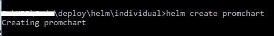
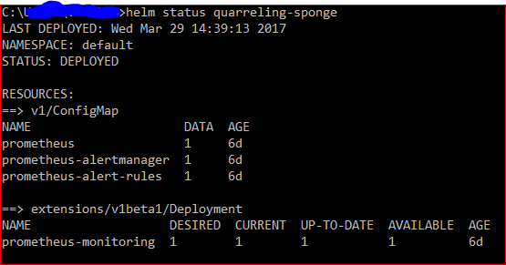
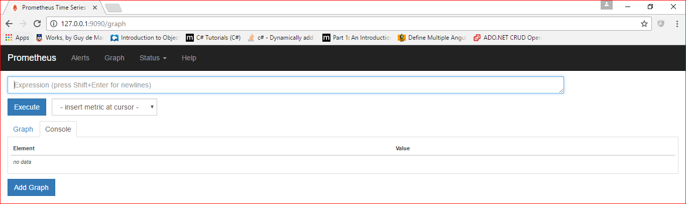
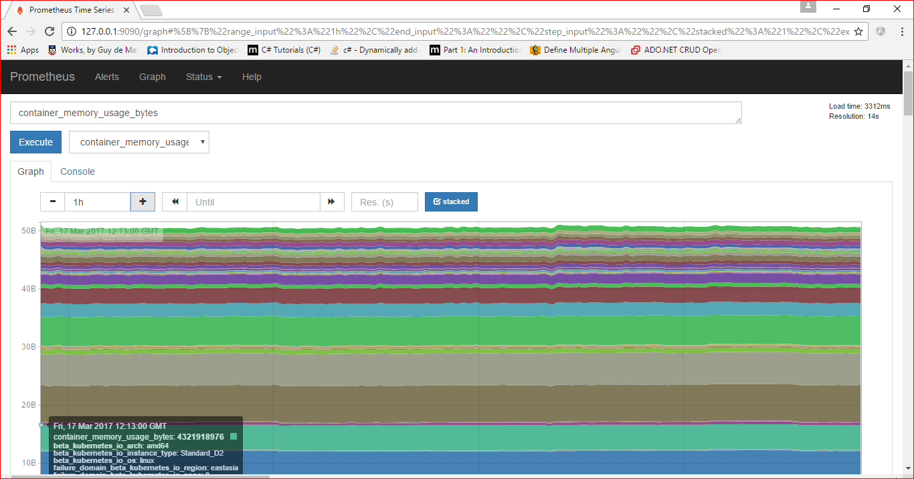
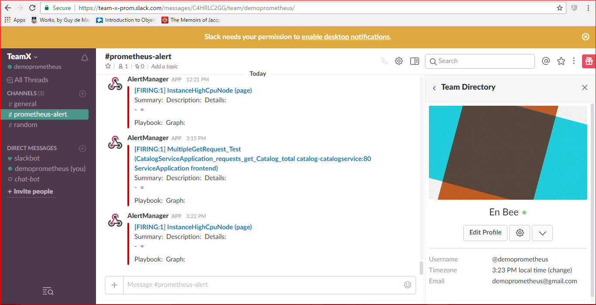
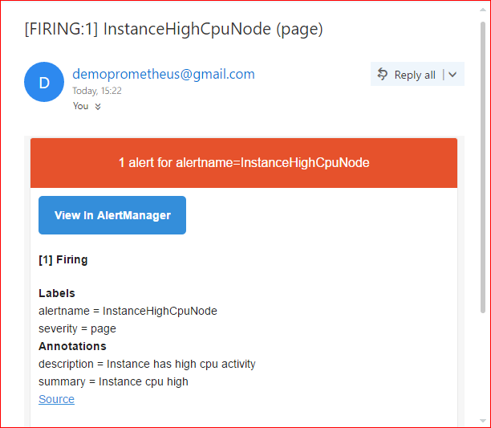

# **Implementing Monitoring and Alerts with Prometheus on Kubernetes**

Prometheus is an open-source system that helps in monitoring and
alerting toolkit. This system was originally built at SoundCloud. For
more information, visit
[Prometheus](https://prometheus.io/docs/introduction/overview/).io

In this lab, learn how to:

- Setup Prometheus to monitor the Parts Unlimited MRP application and
    ACS kubernetes cluster.
- Send alert messages for triggering the flagged events.

## Prerequisites

Following are the prerequisites required to implement Prometheus:

- Kubernetes setup with helm installed
- Completion of
    [HOL1](https://dxdevop.visualstudio.com/mrpmicro/_git/docs?path=%2FHOL1%2FHOL1_readme.md)
    or
    [HOL2](https://dxdevop.visualstudio.com/mrpmicro/_git/docs?path=%2FHOL2%2FHOL2_readme.md)
- PartsUnlimited MRP cloned to local drive using the VSTS credentials
- (optional) Slack account – to send actual alert to slack
- (optional) SMTP service – to send actual alert to email

## Flow of tasks

1. Creating Prometheus helm chart
1. Installing Prometheus helm chart
1. Monitoring application code using Prometheus
1. Performing port forwarding
1. Monitoring logs and firing alerts using Prometheus

## 1. Creating Prometheus helm chart

Perform the following steps to create Prometheus helm chart:

1. Navigate to the path where all the helm charts are present in the
    PartsUnlimited MRP directory structure. (For example:
    ../deploy/helm/individual) and run the following command:

        Helm create promchart

    

     For more information about creating helm chart, refer to [HOL
     1](https://dxdevop.visualstudio.com/mrpmicro/_git/docs?path=%2FHOL1%2FHOL1_readme.md)

1. Update the deployment.yaml and service.yaml file present at \
    ../ deploy/helm/individual/promchart/templates in the local clone

    **helm create** will create a templates folder. Inside templates folder,
    the following files are present that needs to be customized:

    - deployment.yaml

    - service.yaml

    ### **Deployment.yaml**

    This file contains the references to the Prometheus image, AlertManager
    image, and to the configurations associated with them.

    Following keys are used to describe the yaml:

    1. image: Docker image location that can be referenced
    1. args: Allowed arguments with the given image
    1. containerPort: The TCP port through which the container is available
    1. volumeMount: Has the description of various mountPaths along with
        its name
    1. mountPath: The physical location where the files will be stored

    Following is the content of deployment.yaml

         # Prometheus server
            - name: {{.Values.prometheus.name}}
                image: {{.Values.prometheus.repository}}:{{.Values.prometheus.tag}}
                args:
                - '-storage.local.retention=24h'
                - '-storage.local.path=/home'
                - '-storage.local.memory-chunks=500000'
                - '-config.file=/etc/prometheus/prometheus.yml'
                - '-alertmanager.url=http://localhost:9093'

                ports:
                - name: web
                containerPort: {{.Values.prometheus.containerPort}}
                volumeMounts:
                - name: config-volume-prometheus
                mountPath: {{.Values.prometheus.configVolumePrometheusMountPath}}
                - name: config-volume-alert-rules
                mountPath: {{.Values.prometheus.configVolumeAlertRulesMountPath}}
                - name: prometheus-data
                mountPath: {{.Values.prometheus.prometheusDataMountPath}}
         # Alert manager
            - name: {{.Values.prometheusAlertManager.name}}
                    image: {{.Values.prometheusAlertManager.repository}}:{{.Values.prometheusAlertManager.tag}}
                    args:
                    - -config.file={{.Values.prometheusAlertManager.configFile}}
                    volumeMounts:
                    - name: config-volume-alertmanager
                    mountPath: {{.Values.prometheus.configVolumePrometheusMountPath}}
         # Node-exporter
            - name: {{.Values.prometheusNodeExporter.name}}
            image: {{.Values.prometheusNodeExporter.repository}}:{{.Values.prometheusNodeExporter.tag}}
         # Volumes and config maps
            volumes:
            - name: config-volume-prometheus
                configMap:
                name: prometheus
            - name: config-volume-alertmanager
                configMap:
                name: prometheus-alertmanager
            - name: config-volume-alert-rules
                configMap:
                name: prometheus-alert-rules
            - name: prometheus-data
                emptyDir: {}

    ### **Service.yaml**

    This file contains the definition for the following configurations with
    the alert rules:

    - Prometheus.yml

    - alertmanager.yml

        ```bash
        ---
        apiVersion: v1
        kind: ConfigMap
        metadata:
        name: prometheus
        labels:
        chart: "{{ .Chart.Name }}-{{ .Chart.Version | replace "+" "\_" }}"
        data:

        prometheus.yml: |
        .
        .
        .
        apiVersion: v1
        kind: ConfigMap
        metadata:
        name: prometheus-alertmanager
        data:

        alertmanager.yml: |-
        .
        .
        .
        apiVersion: v1
        kind: ConfigMap
        metadata:
        name: prometheus-alert-rules
        data:
        alert.rules: |-
        .
        .
        ```

    To make the Prometheus server pull the metrics from the application,
    zipkin server, and [node
    exporter](https://github.com/prometheus/node_exporter), following lines
    need to be added under the Prometheus.yml respectively.

    #### ServiceApp endpoint
            - job_name: 'ServiceApplication'
            metrics_path: /prometheus
            #scheme defaults to 'http'.
                static_configs:
                    - targets: ['catalog-catalogservice:80']
    #### Zipkin endpoint
            - job_name: 'zipkin'
            metrics_path: /prometheus
            # scheme defaults to 'http'.
                static_configs:
                    - targets: ['zipkin:9411']
    #### Node Exporter endpoint
            - job_name: 'nodeexporter'
            scrape_interval: 5s
            static_configs:
                - targets: ['localhost:9100']


Alertmanager.yml file is used for defining the configurations such as
the sender, receiver detail, the alert mode, and so on. For further
reference on alert manager, check [What is alert
manager](https://prometheus.io/docs/alerting/alertmanager/)? and [How to
configure the alert
manager](https://prometheus.io/docs/alerting/configuration/)?

The following line of code define basic alertmanager configuration that
can be used for sending mails and [slack](https://slack.com/) posts on
trigger of alert conditions.

alertmanager.yml: |-
```bash
global:

\# The root route on which each incoming alert enters.

route:

receiver: 'email-me'

\# The labels by which incoming alerts are grouped together. For
example,

routes:

\# This route performs a regular expression match on alert labels to

\# catch alerts that are related to a list of services.

- match:

service: frontend

receiver: email-me

continue: true

- match:

service: backend

receiver: email-me

continue: true

receivers:

- name: email-me

email\_configs:

- to: xxx@outlook.com

from: yyy@gmail.com

smarthost: smtp.gmail.com:587

auth\_username: yyy@gmail.com

auth\_identity: yyy@gmail.com

auth\_password: \*\*\*\*\*\*\*

slack\_configs:

- send\_resolved: true

api\_url: 'https://hooks.slack.com/services/XXXXXX'

channel: '\#prometheus-alert'

text: >-
    Summary:
    Description:
```
To set up SMTP and Slack services following links can be checked

1. Send Email with alert manager

1. Set up Slack with alert manager

Alert rules are used for defining the conditions that causes the alerts
to trigger; for further reading on alerting, refer the following
[link](https://prometheus.io/docs/alerting/rules/).

The following lines define basic condition for triggering an alert.
Alert rules support labels and annotations as well.

```bash
alert.rules: |-

\#\# alert.rules \#\#

\#

\# CPU Alerts

\#

ALERT HighCPU

IF (rate(container\_cpu\_usage\_seconds\_total{image!=""}\[5m\])\*100)

FOR 10m

LABELS {service = "backend”}

ANNOTATIONS {

summary = "High CPU Usage",

description = "This machine has really high CPU usage for over 10m",

}
```

### **Values.yaml**

This file contains the values that can be used as configuration
properties, across the yaml files like deployment.yaml, service.yaml.

### **prometheus:**

```bash
repository: quay.io/prometheus/prometheus

tag: v1.0.1

pullPolicy: IfNotPresent

name: prometheus

retention: 24h

path: /home

memoryChunk: 500000

configFile: /etc/prometheus/prometheus.yml

containerPort: 9090

configVolumePrometheusMountPath: /etc/prometheus

configVolumeAlertRulesMountPath: /etc/prometheus-rules

prometheusDataMountPath: /home

prometheusAlertManager:

name: alertmanager

repository: quay.io/prometheus/alertmanager

tag: v0.5.0

pullPolicy: IfNotPresent

configFile: /etc/prometheus/alertmanager.yml

prometheusNodeExporter:

name: nodeexporter

repository: quay.io/prometheus/node-exporter

tag: latest

pullPolicy: IfNotPresent

service:

name: prometheus

type: LoadBalancer

externalPort: 9090

internalPort: 9090

resources:

limits:

cpu: 500m

memory: 128Mi

requests:

cpu: 100m

memory: 128Mi

```

## 2\. Installing helm Prometheus chart

To install the Prometheus, navigate to the path where all helm charts
are present in the cloned Parts Unlimited repository (In this case
../deploy/helm/individual), and run the following command:

> *helm install promchart --name=myprom*



Prometheus server should now be deployed. Run \`helm status myprom\` and
ensure the deployment says available 1.

## 3\. Monitoring the application code using Prometheus

Prometheus uses pull mechanism to scrape data from a server or app where
the endpoints are exposed to Prometheus, so to make Prometheus able to
fetch data, end points need to be exposed.

*The PartsUnlimited MRP is a spring boot application using gradle build
and the lab uses gradle steps for build.*

To instrument the application code and expose the end points to
Prometheus server, perform the following steps:

- *Define the Prometheus apis under the dependencies section, in
    ‘build.gradle’ file located **\[ServiceName\]\\build.gradle**.*

    > dependencies {
    >
    > compile('io.prometheus:simpleclient:0.0.21')
    >
    > compile('io.prometheus:simpleclient\_common:0.0.21')
    >
    > compile('io.prometheus:simpleclient\_spring\_boot:0.0.21')
    >
    > }

- *Add the following line to enable the access to Prometheus endpoint.
    **management.security.enabled=false** in **application.properties***
    *file* *present in **‘\[ServiceName\]\\src\\main\\resources’**.*

    *If deploying applications behind a firewall, it’s preferable that
    actuator endpoints can be accessed without requiring authentication.
    For more information please check this
    [link](http://docs.spring.io/spring-boot/docs/current/reference/html/production-ready-monitoring.html#production-ready-sensitive-endpoints).*

- *Expose the application to Prometheus server* by adding the
    following annotations on the main method for the
    springBootApplication “@EnablePrometheusEndpoint,
    @EnableSpringBootMetricsCollector”*.*

    > @EnablePrometheusEndpoint
    >
    > @EnableSpringBootMetricsCollector
    >
    > **public** **class** OrderServiceApplication {
    >
    > **public** **static** **void** main(String\[\] args) {
    >
    > SpringApplication.*run*(OrderServiceApplication.**class**, args);
    >
    > System.***out***.printf("Order Service Ready for use %n");
    >
    > }
    >
    > }

- *Following is a snippet of code used for instrumenting the app.* It
    describes how to declare a variable of [data
    types](https://prometheus.io/docs/concepts/metric_types/) provided
    by Prometheus API and also how to put them in the method.

    > //Declaring Counter variable to determine number of time get Catalog
    > is called
    >
    > **static** **final** Counter ***getCatalogCounters*** =
    > Counter.*build*()
    >
    > .name("CatalogServiceApplication\_requests\_get\_Catalog\_total")
    >
    > .help("Request get calls for Catalog.").register();
    >
    > @RequestMapping("/all")
    >
    > **public** List&lt;Catalog&gt; getAllCatalogs() {
    >
    > Summary.Timer requestTimer = ***requestLatency***.startTimer();
    >
    > **try** {
    >
    > // Service logic code goes here.
    >
    > // Incrementing the counter variabele declared
    >
    > ***getCatalogCounters***.inc();
    >
    > **return** os.getAllCatalogs();
    >
    > } **catch** (Exception e) {
    >
    > **throw** e;
    >
    > } **finally** {
    >
    > requestTimer.observeDuration();
    >
    > }
    >
    > }

## 4. Port forwarding

After the helm install, the Prometheus gets deployed and port forwarding
is completed to view the Prometheus dashboard on local host.

To perform port forwarding, run the following commands

```bash
kubectl get pods \#retrieve the name of the PrometheusPodName for next
step

kubectl port-forward \[PromethusPodName\]
\[ExternalPort\]:\[Portnumber\]
```

\#PromethusPodName: This is the name of the pod.

\#ExternalPort: The port on which Prometheus will be available on
localhost

\#Portnumber: the default port number is 9090


>*kubectl port-forward* *prometheus-monitoring-3680535693-wzv23
9090:9090*

>*Forwarding from 127.0.0.1:9090 -&gt; 9090*

>*Forwarding from \[::1\]:9090 -&gt; 9090*



## 5. Monitoring logs and firing alert using Prometheus

Prometheus can be accessed using 127.0.0.1:9090 in the browser after
port forwarding.

In the **Graph** tab, there is a query text box where the query
expression can be executed.

For query construct, this
[link](https://prometheus.io/docs/querying/basics/) can be explored.

The container related metrics starts with “container” and the following
are the commonly used container metrics:

- container\_cpu\_usage\_seconds\_total

- container\_memory\_usage\_bytes

- container\_cpu\_usage\_seconds\_total{container\_name="deis-builder"}
    , it describes CPU usage by Deis-Builder.

The metrics exposed by node-exporter starts with “node” and the
following are the commonly used metrics to monitor VM /Node level stats:

- node\_memory\_MemAvailable

- node\_cpu

The metrics instrumented in Catalog service code starts with “catalog”.
The typical metrics to monitor catalog services are:

- CatalogServiceApplication\_inprogress\_requests

- CatalogServiceApplication\_requests\_latency\_seconds\_sum

Zipkin Server also exposes metrics to Prometheus like:

- zipkin\_collector\_spans\_http

- zipkin\_collector\_bytes\_http



Alerting is achieved by defining the alert conditions in service.yaml
under the alert.rules segment.

List of defined alerts can be seen at <http://127.0.0.1:9090/alerts>

On occurrence of the following alert scenarios, alert is fired to the
slack channel and the email receiver is configured.

- **InstanceHighCpuNode**

  - High utilisation of the CPU by the node

    > ALERT InstanceHighCpuNode
    >
    > IF 100 - (avg by (host) (irate(node\_cpu{mode="idle"}\[5m\])) \* 100)
    > &gt; 5
    >
    > FOR 10m LABELS { severity = "page" }
    >
    > ANNOTATIONS {
    >
    > summary = "Instance cpu high",
    >
    > description = "Instance has high cpu activity"
    >
    > }

-   **InstanceLowMemory**

    -   Low working memory

        > ALERT InstanceLowMemory
        >
        > IF node\_memory\_MemAvailable &lt; 268435456
        >
        > FOR 10m
        >
        > LABELS { severity = "page" }
        >
        > ANNOTATIONS {
        >
        > summary = "Instance has memory low",
        >
        > description = "Instance has less than 256M memory available"
        >
        > }

-   **InstanceLowDisk**

    - Low disk space in the file system

        > ALERT InstanceLowDisk
        >
        > IF node\_filesystem\_avail{mountpoint="/etc/hosts"} &lt; 10737418240
        >
        > FOR 10m LABELS { severity = "page" }
        >
        > ANNOTATIONS {
        >
        > summary = "Instance has low disk space",
        >
        > description = "Instance has less than 10G FS space"
        >
        > }

The following screenshot shows a sample alert being fired on Slack using
configuration from alert manager.



The following screenshot shows a sample alert being fired to email using
configuration from alert manager.



## Conclusion

This document covers the steps to implement Prometheus on the Kubernetes
infrastructure using **helm** (the medium of installation). Typical
alerting use cases have been enlisted that can be useful in any
application.
