# **Implementing Opentracing on Kubernetes**

In this lab, we will learn how to setup
[Opentracing](http://opentracing.io/) using [Brave Instrumentation to
Opentracing bridge](https://github.com/openzipkin/brave-opentracing) and
[Zipkin](http://zipkin.io/) as a pluggable tracer on Helm Kubernetes
environment. OpenTracing is a thin standardization layer of API that
sits between application/library code and various systems that consume
tracing and causality data. There are various
[tracers](http://opentracing.io/documentation/pages/supported-tracers.html)
supported by Opentracing, this HOL will use Zipkin as the pluggable
tracer.

## Prerequisites

- Completion of
    [HOL1](https://dxdevop.visualstudio.com/mrpmicro/_git/docs?path=%2FHOL1%2FHOL1_readme.md)
    or
    [HOL2](https://dxdevop.visualstudio.com/mrpmicro/_git/docs?path=%2FHOL2%2FHOL2_readme.md) Which means the MRP application is deployed to an Azure Container Service with Kubernetes.
- Familiarity with Docker, Azure Container Registry (ACR), Azure Container Service (ACS). Follow [HOL1](https://dxdevop.visualstudio.com/mrpmicro/_git/docs?path=%2FHOL1%2FHOL1_readme.md) for more details.
- Installation of [Java 8+](http://www.oracle.com/technetwork/java/javase/downloads/index.html),[Gradle](https://gradle.org/install)
- Parts Unlimited MRP cloned to local drive using the VSTS credentials

## This is the workflow to follow

1. Setup Zipkin server
    1. Setup Cassandra Database on kubernetes
    1. Configure Zipkin server spring boot application
    1. Build Zipkin Docker Image and deploy on kubernetes
1. Instrumenting application for opentracing
    1. Configuring dependencies
    1. Instrumenting services for opentracing
    1. Understanding traces and use-cases covered

## 1\. Setup Zipkin Server

[Zipkin-server](https://github.com/openzipkin/zipkin/tree/master/zipkin-server)
is a [Spring
Boot](http://docs.spring.io/spring-boot/docs/current/reference/htmlsingle/) application,
packaged as an executable jar to display traces. The quickest way to get
started is to fetch the [latest released
server](https://search.maven.org/remote_content?g=io.zipkin.java&a=zipkin-server&v=LATEST&c=exec) as
a self-contained executable jar, which uses default in-memory storage
for span storage. This HOL will focus on creating customised Zipkin
Spring Boot application to use Cassandra DB as persistent span storage.
Note that the Zipkin server requires minimum JRE 8.

## 1a. Setup Cassandra Database on Kubernetes

[Apache Cassandra](http://cassandra.apache.org/) is a free and
open-source distributed database system designed to handle enormous
amount of data across multiple servers, providing high availability with
no one point of failure. The deployment of the Cassandra cluster relies
on [persistent
volumes](https://kubernetes.io/docs/user-guide/persistent-volumes/). A
[PersistentVolumeClaim](https://kubernetes.io/docs/user-guide/persistent-volumes/#persistentvolumeclaims)
is created and mounted in the directory*/cassandra-data* as per
Cassandra instance. The steps to setup Cassandra DB on Kubernetes are as
follows:

1. Navigate to the path where Cassandra helm charts are present in Parts Unlimited MRP project directory structure (In this case ../deploy/helm).

1. By default, these charts use the default StorageClass for the provider where Kubernetes is running. For creating default storage class, yaml file should resemble:
    ```bash
    apiVersion: storage.k8s.io/v1beta1
    kind: StorageClass
    metadata:
           name: default
        annotations: storageclass.beta.kubernetes.io/is-default-class:"true"
    provisioner: kubernetes.io/azure-disk
    ```
   Execute the following command to create storageClass:
    ```bash
    kubectl create -f C:\\users\\&lt;username&gt;\\Desktop\\azure.yaml
    ```
1. Deploy Cassandra helm charts:
    ```bash
    helm install Cassandra --name cassandradb
    ```

    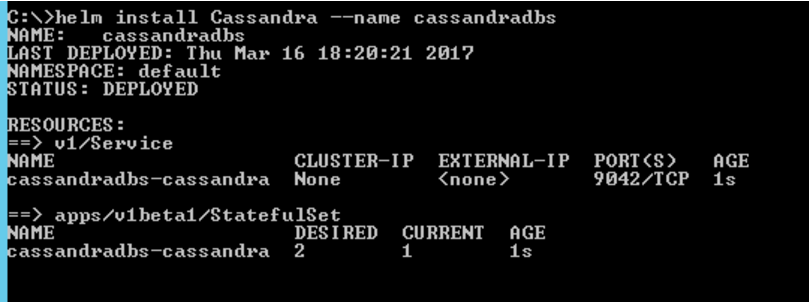

    This will create persistent volume claim and persistent volumes which
can be verified by executing following commands:
    ```bash
    kubectl get services
    ```

    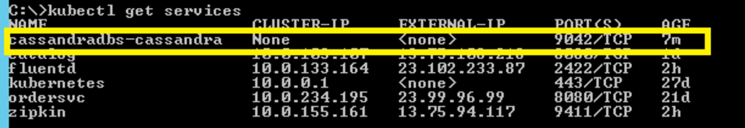
    ```bash
    kubectl get pods
    ```

    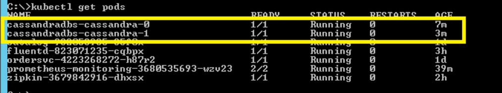

## 1b. Configure Zipkin Server Spring Boot Application

Once Cassandra DB is setup, follow below steps to build customized
Zipkin server and configure Cassandra DB as storage:

1. Navigate to the customized Zipkin Server spring boot application
    present in Parts Unlimited MRP project directory. In this case
    (../zipkinServer).

1. Edit Cassandra contact points in *application.properties
    (../Zipkinserver/* /src/main/application.properties) file as:

    Zipkin.storage.cassandra3.contact-points=cassandradbs (##Comma separated list of hosts/IP addresses part of Cassandra cluster).

1. To build jar file for Zipkin server, execute the following command:
   ```bash
   gradlew build
   ```

    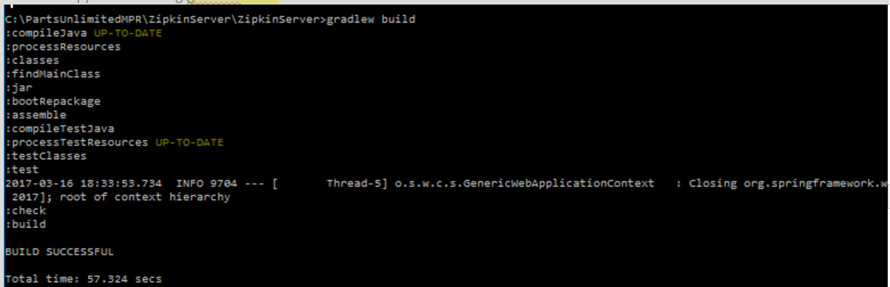

This will create an executable jar file inside ..zipkinserver/build/libs
folder .

## 1c. Build Zipkin Docker Image and Deploy on Kubernetes

Once Zipkin server executable jar file is available, follow the steps to
create Zipkin docker image and deploy it on Kubernetes:

1. Login to Azure container registry
     ```bash
    docker login –u username –p password registryUrl
    ```

1. Create docker file as:
    ```bash
    FROM java:8
    MAINTAINER <username@microsoft.com>
    RUN mkdir -p /usr/local/app
    WORKDIR /usr/local/app
    COPY \* /usr/local/app/
    EXPOSE 9411
    ENTRYPOINT \["java", "-jar", "ZipkinServer-0.0.1-SNAPSHOT.jar"\]
    ```

1. Build docker image

    docker build -t puregistry-on.azurecr.io/zipkin .

    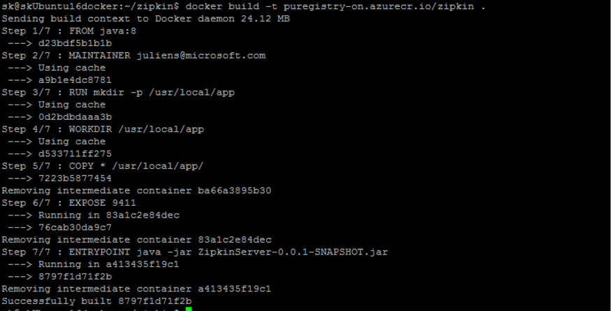

1. Push docker image to registry
    ```bash
    docker push puregistry-on.azurecr.io/zipkin
    ```

    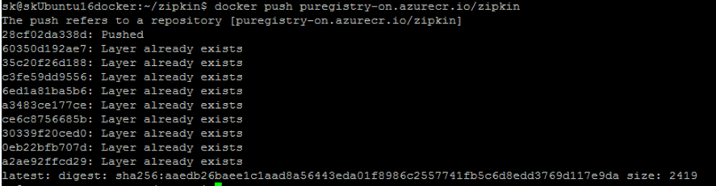

1. Navigate to the path where Zipkin helm charts are present in the
    cloned Parts Unlimited MRP project directory (In this case
    ../deploy/helm/individual) and execute below command to deploy
    Zipkin server on kubernetes:
    ```bash
    helm install zipkinserver –name zipkinserver
    ```

   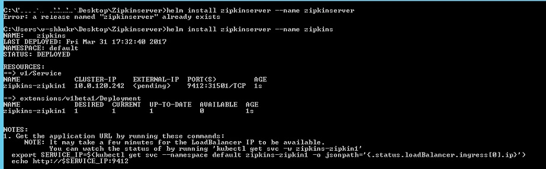

1. Once Zipkin server URL is deployed on Kubernetes, get Zipkin service URL as:

   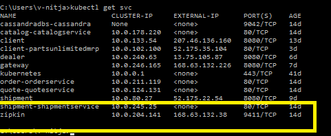

1. Browse Zipkin service URL to view UI.

## 2\. Instrumenting Application for Opentracing

Opentracing provides an API to instrument microservice code to track
causality data. The Parts Unlimited MRP project referenced in this HOL
is a Java Spring Boot application consisting of client as well as
backend microservices. Follow the steps to instrument java microservices
code for opentracing using Brave-Opentracing Bridge provided by Zipkin.
Follow the [link](https://github.com/openzipkin/brave-opentracing) for
further information on Brave to Opentracing Bridge.

## 2a. Configuring Dependencies

Add below mentioned opentracing and brave dependencies to
***build.gradle*** file located at **\[Services/build/gradle\]**:

```bash
compile('io.opentracing:opentracing-api:0.20.10')
compile('io.opentracing.brave:brave-opentracing:0.18.1')
compile('io.zipkin.brave:brave:4.0.6')
compile('io.zipkin.reporter:zipkin-reporter')
compile('io.zipkin.reporter:zipkin-sender-okhttp3:0.6.12')
```

## 2b. Instrumenting Services for Opentracing

This HOL will refer the catalog service which is part of the cloned
repo, all the following changes are already part of the Parts Unlimited
MRP repository for reference.

1. The following code snippet from catalogController.java
    (**“..code/CatalogSrvc/src/main/java/smpl/order/controller/catalogController.java**”
    ) is used to create Zipkin span reporter and opentracing tracer to
    send trace data to Zipkin server.

    > *OkHttpSender sender = OkHttpSender.create("<http://zipkin-server-url-from-step-1.7-above;/api/v1/spans>");*
    >
    > *AsyncReporter&lt;Span&gt; reporter =
    > AsyncReporter.builder(sender).build();*
    >
    > //Create a Brave tracer with the service name you want to see in
    > Zipkin:
    >
    > *Tracer braveTracer = Tracer.newBuilder()*
    >
    > *.localServiceName("catalog-svc")*
    >
    > *.reporter(reporter)*
    >
    > *.build()*
    >
    > //Wrap brave with the OpenTracing API:
    >
    > *Tracer tracer = BraveTracer.wrap(braveTracer);*

1. The following code snippet from CatalogController.java
    **(..code/PartsUnlimitedMRP\_Client/src/main/java/com/ms/mrpclient/controllers/CatalogController.java)**
    is used to create a new span in client code and propagate span data
    along with the outgoing HTTP request to service for tracing time
    taken to complete end to end calls from client to server:

    > *Map&lt;String, String&gt; map = new HashMap&lt;String, String&gt;();*
    >
    > //Create span for tracing call
    >
    > *io.opentracing.Span span =
    > tracer.buildSpan("GetCatalog").withTag("Description",
    > "GetData”).start();*
    >
    > *brave.Span braveSpan = ((BraveSpan) span).unwrap();*
    >
    > *braveSpan.kind(Kind.CLIENT);*
    >
    > //Inject trace data into the outgoing request from client to backend
    > service.
    >
    > *tracer.inject( span.context(), Format.Builtin.HTTP\_HEADERS, new
    > TextMapInjectAdapter(map)); *
    >
    > *headers.setAll(map)*
    >
    > *try{*
    >
    > //make request call to service
    >
    > *Span.log(“call ended”);*
    >
    > *}*
    >
    > *Catch(Exception e){*
    >
    > //log error event*span.log(“error”',e.getMessage());}*
    >
    > *Finally{*
    >
    > //Finish span *braveSpan.finish();*
    >
    > *}*

1. The following code snippet from catalogController.java
    (**“..code/CatalogSrvc/src/main/java/smpl/order/controller/catalogController.java**”
    ) is used to extract a SpanContext that has been propagated
    alongside the incoming request from client and create child spans to
    traces server side execution:

    > //Extract tracing information from request header
    >
    > *String traceId = request.getHeader("X-B3-TraceId")*
    >
    > *String spanId = request.getHeader("X-B3-SpanId");*
    >
    > *String sampleId = request.getHeader("X-B3-Sampled");*
    >
    > *Map&lt;String, String&gt; map = new LinkedHashMap&lt;&gt;();*
    >
    > *map.put("X-B3-TraceId", traceId);*
    >
    > *map.put("X-B3-SpanId", spanId);*
    >
    > *map.put("X-B3-Sampled", sampleId);*
    >
    > //Create context from incoming tracer information
    >
    > *BraveSpanContext openTracingContext = (BraveSpanContext)
    > tracer.extract(Format.Builtin.HTTP\_HEADERS,*
    >
    > *new TextMapExtractAdapter(map));*
    >
    > //create child span
    >
    > *io.opentracing.Span span = tracer.buildSpan("CatalogService") *
    >
    > *.asChildOf(openTracingContext)*
    >
    > *.withTag("Description", "Get All Catalogs")*
    >
    > *.withTag("http\_request\_url", request.getRequestURI().toString())
    > .start(); *
    >
    > *brave.Span braveSpan = ((BraveSpan) span).unwrap();*
    >
    > *braveSpan.kind(Kind.SERVER);*
    >
    > *Try {*
    >
    > //do something
    >
    > *}*
    >
    > *Catch (Exception e) *
    >
    > *{*
    >
    > //log error event
    >
    > *span.log(“error”',e.getMessage());*
    >
    > *}*
    >
    > *Finally\
    > {*
    >
    > //Finish Span
    >
    > *braveSpan.finish();*
    >
    > *} *

1. The following code snippet from catalogController.java
    (**“..code/CatalogSrvc/src/main/java/smpl/order/controller/catalogController.java**”
    ) is used demonstrates how to track function calls using
    opentracing:

    > //create span inside a function
    >
    > *io.opentracing.Span mongospan = tracer.buildSpan("MongoService")*
    >
    > *.asChildOf(span)*
    >
    > *.withTag("Description", "MongoDB Service Call")*
    >
    > *. start()*
    >
    > *brave.Span braveMongoSpan = ((BraveSpan) mongospan).unwrap();*
    >
    > //below code calls a function and get data from Database
    >
    > *Catalog catalogItem = service.getCatalogItem(sku,mongospan); *
    >
    > *braveMongoSpan.finish();*

1. Opentracing also helps to log events as they occur during execution
    of request. The following code snippet demonstrates how to log
    events before span is finished:

    > //create span
    >
    > *io.opentracing.Span span =
    > tracer.buildSpan("GetCatalog").withTag("Description",
    > "GetData”).start();*
    >
    > //log event
    >
    > *span.log(“GetCallEnded”);*

## 2c. Understanding Traces and Use-cases covered

The following scenarios are implemented in Parts Unlimited MRP project
using Opentracing and explained with reference to catalog service.

### **1. Tracing End-to-End calls:**

This scenario explains how to trace an end to end execution of requests
from parts unlimited MRP client to backend services (In this case:
catalog service). Refer section 2b and go through steps 1 to 3 above to
understand the instrumentation code needed to trace complete end to end
calls.

Steps to replicate the scenario:

1. Navigate to the URL where Parts Unlimited MRP project is deployed.

    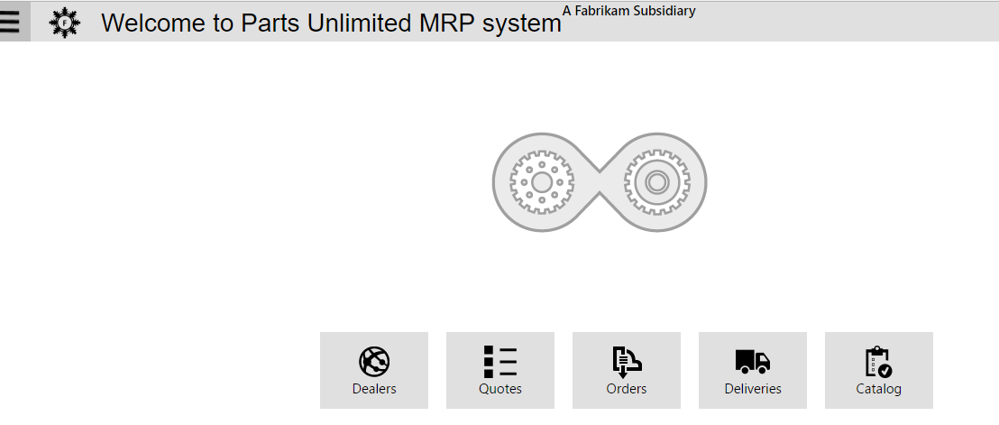

1. Click on Catalog.

1. Click on add catalog, add details for catalog creation and save
    catalog.

    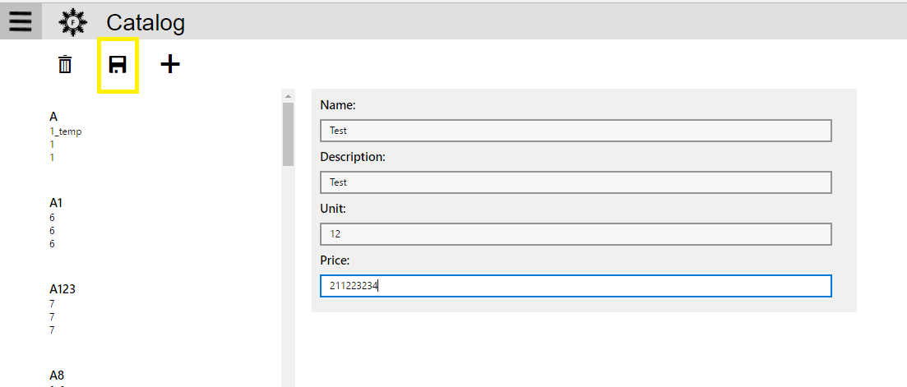

1. On successful creation of catalog, navigate to Zipkin server URL.

1. On Zipkin UI, select the service name from the dropdown (In this
    case: “mrp-cleint”) and click **Find Traces** to view traces:

    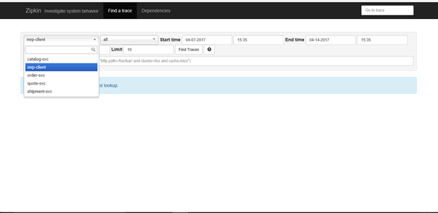

1. The following screen demonstrates trace information for end-to-end
    call from Parts Unlimited MRP client to services:

    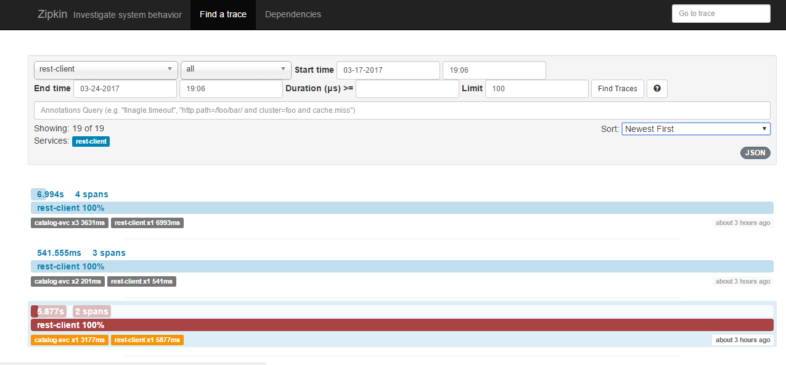

1. Click on traces to view details

    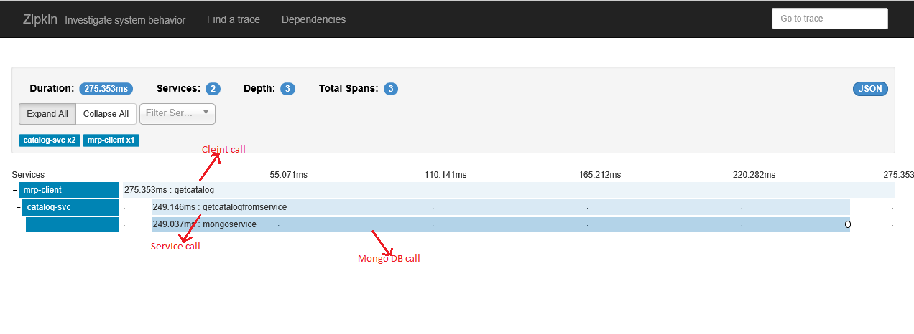

    *Client call trace:*

    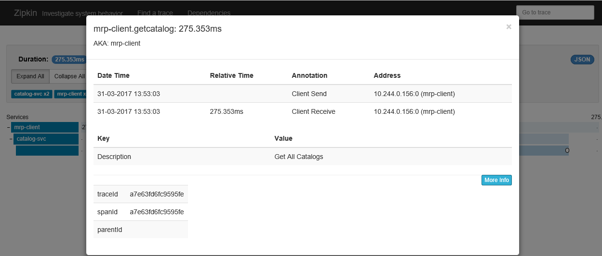

    *Server Endpoint trace:*

    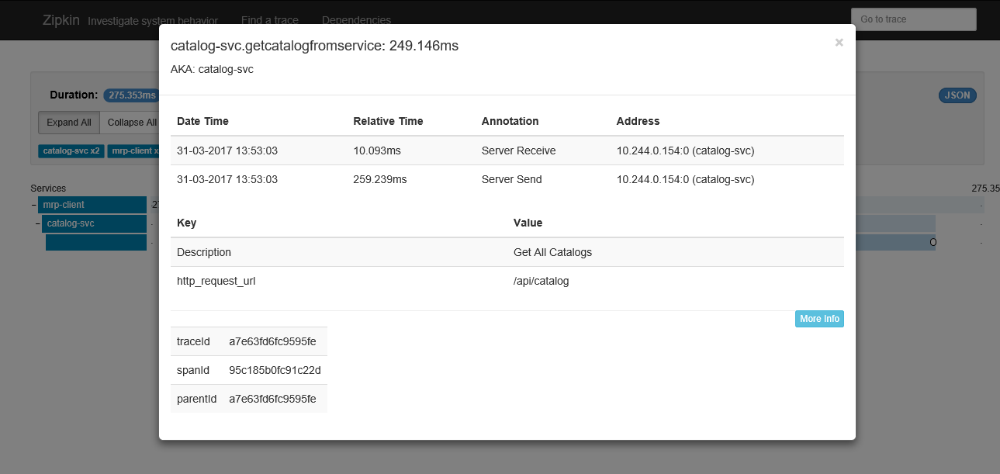

### **2. Tracing Functions:**

This scenario explains how to trace execution of functions within the
Parts unlimited MRP project. Refer section 2b - step 4 to understand the
instrumentation code needed in the service code for tracing function
calls.

Steps to replicate the scenario:

1. Navigate to the URL where Parts Unlimited MRP project is deployed
    and create catalog.

1. Navigate to Zipkin UI and open the recently generated trace to view
    spans.

1. Click on the child spans to view function execution details.

    The following screen demonstrates tracing information for a function
call:

    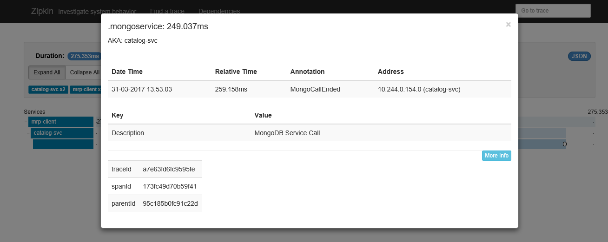

The Parts Unlimited MRP project referenced in this HOL also implements
Hystrix fault tolerance and latency tracing library. For further
information on Hystrix, follow this
[link](https://github.com/Netflix/Hystrix). If any error is encountered
during function execution, Hystrix fallback methods will be called and
this will be logged as error trace in Zipkin.

Steps to replicate the scenario:

1. Navigate to kubernetes dashboard where all the services are deployed
    and set replica set as “0” in the Deployment.yaml for catalog
    service. This will make catalog service pod count to zero, thereby
    stopping the service.

1. Navigate to the URL where Parts Unlimited MRP project is deployed
    and try to get catalog.

1. Navigate to Zipkin Server URL to view recently created traces.

1. Open recently created error trace and view error child span.

1. Expand the spans to view detail error.

    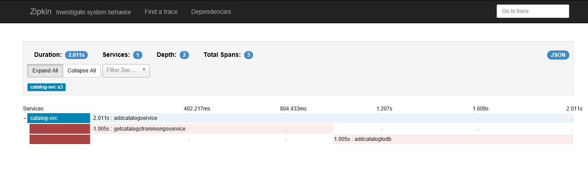

    Following screen demonstrates execution of hystrix fallback method and
    error logged during execution of request

    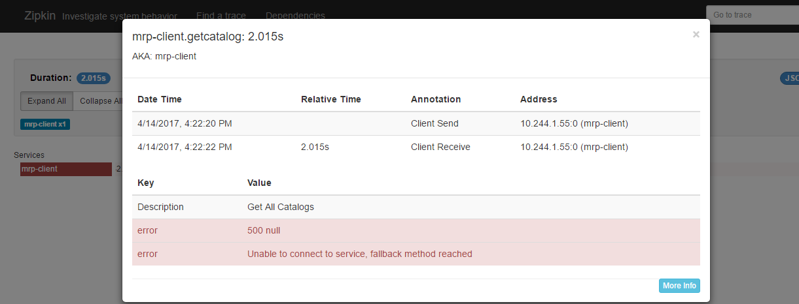

1. Navigate to kubernetes dashboard, and set replica set as “1” in the
    Deployment.yaml for catalog service to re-create catalog service
    pod.

### **3. Logging Events:**

This scenario explains how to log events as they occur during execution
of request from Parts Unlimited MRP client to services. Refer section 2b
above and follow step for the instrumentation code for logging events.

Steps to replicate the scenario:

1. Navigate to the URL where Parts Unlimited MRP project is deployed
    and create catalog.

1. Navigate to Zipkin UI and open the recently generated trace to view
    span.

1. Click on the child spans to view the events logged during execution.

The following screen demonstrates events logged during requests
execution:


### **4. Send Opentracing Metrics to Prometheus (Optional)**

Zipkin server implemented in this HOL exposes ***/prometheus*** endpoint
to send Opentracing metrics to Prometheus, an Application Performance
Monitoring system which helps to view data on time scale. For further
information on how Prometheus is implemented in parts unlimited MRP
project follow
[HOL4.](https://dxdevop.visualstudio.com/mrpmicro/_git/docs?path=%2FHOL4%2FHOL4_readme.md)

To View the metrics exposed to Prometheus, navigate to Prometheus
endpoint of Zipkin server URL (ex. <http://zipkin-server-url-from-step-1.7-above/api/v1/spans>)

To View metrics in Prometheus, perform below steps:

1. Navigate to Prometheus URL.

1. Go to graph tab and select the metrics from dropdown or enter the metric name in query window.

Below screenshot shows the Prometheus chart for
***status\_200\_api\_v1\_traces*** metrics which displays a graph of all
successful hits on a time scale:


## Conclusion

This HOL covers how to instrument java microservices code for
Opentracing so as to track the causality data using Zipkin as pluggable
tracer and Cassandra as span storage for Zipkin.
