# Deploy, monitor, and scale using Deis Workflow

In this lab learn how to setup Deis Workflow to deploy, monitor, and scale the  Parts Unlimited MRP front-end website to an Azure Container Service cluster.

Workflow is an open source Platform as a Service (PaaS) that adds a
developer-friendly layer to any Kubernetes cluster, making it easy to
deploy and manage applications. For more information, visit official
[deis](https://deis.com/docs/workflow/) documentation

## Prerequisites

Below are prerequisites required to implement Deis.

- A Github user account
- Azure Container Service with Kubernetes orchestrator provisioned
- Local client has helm and kubectl installed and able to connect to provisioned ACS cluster
- General understanding of Docker and helm. More information is available in
    [this
    HOL](https://dxdevop.visualstudio.com/mrpmicro/_git/docs?path=%2FHOL1%2FHOL1_readme.md&version=GBmaster&_a=contents).
- [Download](https://github.com/deis/workflow-cli) Deis CLI and set
    the command path

## Tasks Overview

1. Install Deis-Workflow via Helm
1. Register Deis Application
1. Create Deis Application via Dockerfile
1. Scale Application
1. Monitor deis-workflow environment using Grafana

### Task 1: Install Deis-Workflow via Helm

**Step 1.** The Deis-Workflow charts are signed so, keys need to be installed in
order to procced with Helm based Deis-Workflow installation

`curl https://deis.com/workflow/docs/security/1d6a97d0.txt | gpg --import`
    
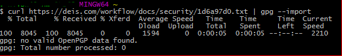

`gpg --keyserver pgp.mit.edu --recv-keys 1D6A97D0`

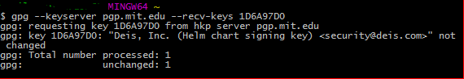

**Step 2.** Now add the Deis-Workflow repository to Helm via:

`helm repo add deis https://charts.deis.com/workflow`

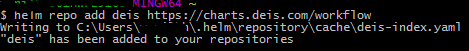

**Step 3.** Finally, install Deis workflow onto the ACS cluster via:

`helm install deis/workflow --namespace deis`

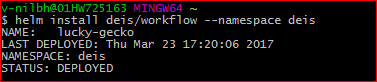

### Task 2: Register with the Deis Application

**Step 1.** To use the Deis-Workflow a user needs to be registered using the
load-balancer ip.

The ip details can be found by executing:

`kubectl --namespace=deis describe svc deis-router`

  > Note: It will take a few minutes for the external IP address to be assigned.  If it says "Creating Load Balancer", just wait and run this command again.

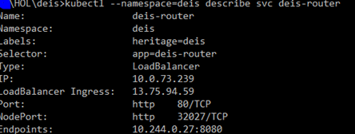

Now copy the [load-balancer-ingress] IP, replace it in the below command, and execute it:

`deis register http://deis.[load-balancer-ingress].nip.io`


After registration user is automatically logged in.

For more information visit this
[link](https://deis.com/docs/workflow/quickstart/deploy-an-app/#register-an-admin-user).

**Step 2.** Logout and Login out of current deis session**

`deis logout`

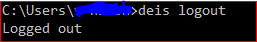

To log in deis session, copy the [load-balancer-ingress] IP, replace it in the below command, and execute:

`deis login http://deis.[load-balancer-ingress].nip.io`

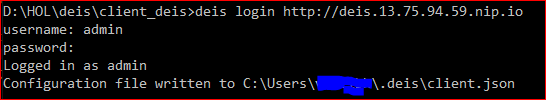

### Task 3: Create Deis Application from Dockerfile

To create Deis Application from external docker image stored in private
registry execute the following commands. For more details visit following link [Deploy Apps using Workflow](https://deis.com/docs/workflow/quickstart/deploy-an-app/)

Before creating deis application from docker file following conditions
should be met:

1. Repository that is used for cloning should contain only the desired application. In this case following repository is used <https://dxdevop.visualstudio.com/mrpmicro/_git/deis> and the [Clients](<https://dxdevop.visualstudio.com/mrpmicro/_git/code?path=%2FClients&version=GBmaster&_a=contents>) code is placed in the repository.
1. Docker file must be present along with the application code in the repository.

[Read more on the Deis workflow Dockerfile requirements](https://deis.com/docs/workflow/applications/using-dockerfiles/#dockerfile-requirements)

**Step 1.** Review Dockerfile

See how the [Dockerfile](https://dxdevop.visualstudio.com/mrpmicro/_git/deis?path=%2FDockerfile&version=GBmaster&_a=contents) contains the instructions for building the container image which will be created by the [Deis builder](https://deis.com/docs/workflow/understanding-workflow/components/#builder-builder-slugbuilder-and-dockerbuilder).

Installs Gradle

```Bash
curl -fl
https://downloads.gradle.org/distributions/gradle-\${GRADLE\_VERSION}-bin.zip
-o gradle-bin.zip \\
```

Builds the app

```Bash
RUN cd /client && gradle build && dir && mv build/libs/\*
/usr/local/tomcat/webapps/
```

Expose the endpoints and run bash command

```Bash
EXPOSE 8080
ENTRYPOINT catalina.sh run
```

**Step 2.** Add SSH Keys and Clone the git repository where Deis resides

First, generate an SSH Key for use with GitHub or use an existing key.  [SSH keys are required](https://deis.com/docs/workflow/applications/using-dockerfiles/#add-ssh-key) for DEIS to be able to access the git repository even if it is public.

`ssh-keygen -f ~/.ssh/id_deis -t rsa`

Add this key to be able to be used by Deis

`deis keys:add ~/.ssh/id_deis.pub`

[Fork the repository](https://help.github.com/articles/fork-a-repo/), replace the base url with your Github name, and then clone it locally using ssh:

`git clone git@github.com:dtzar/pumrp-deis.git`

> Note: do NOT use HTTPS to clone as this will break the build process and using ssh to clone ensures the ssh keys are setup properly.  If clone via ssh fails, then the ssh key used to clone have not been properly added to your own Github account or are not configured properly on the local host executing the clone.

**Step 3.** Create Deis App

`deis create mrp-client-deis`

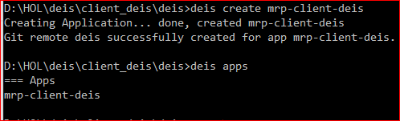

**Step 4.** Push the repository to build the Dockerfile and deploy the image

`git push deis master`

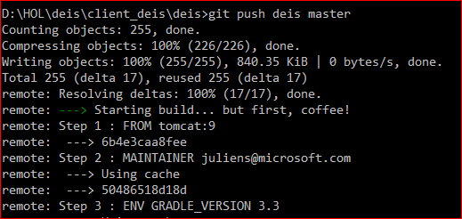

…… omitting intermediate logs

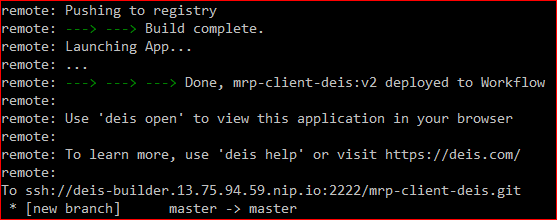

**Step 5.** Launch the application deployed to on deis-workflow

`deis open`

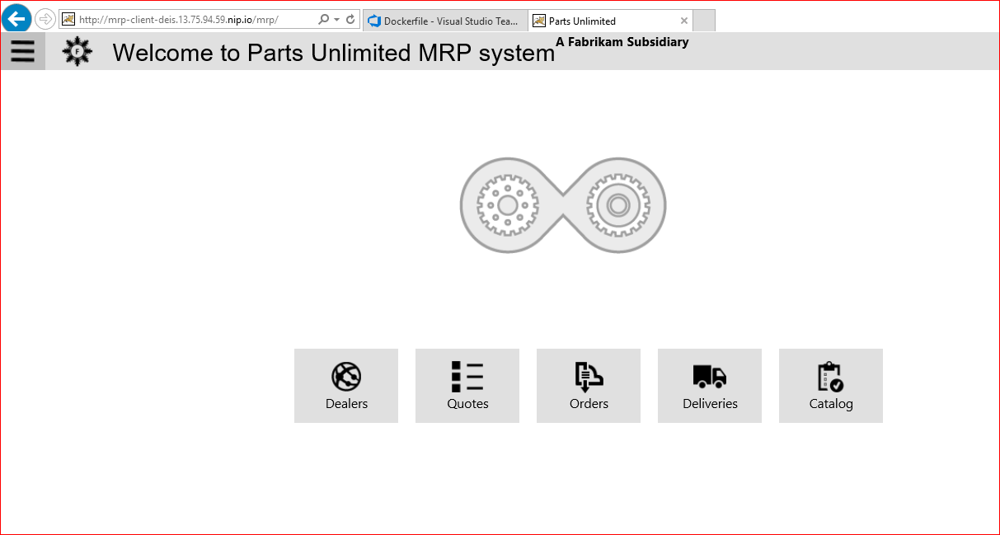

### Task 4: Scale Application

The number of process that are executing can be scaled as per the
requirement

`deis scale cmd=2 -a mrp-client-deis`

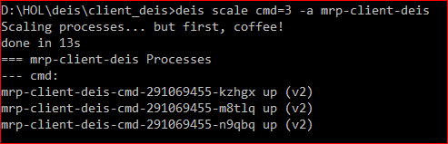

### Task 5: Monitor deis-workflow environment using Grafana

To monitor log of an application deployed using deis-workflow Grafana
can be used as it installed out of the box with deis-workflow.

Default Port for Grafana is 3500  
Default Username/Password is admin/admin

[Read more on Grafana](https://grafana.com/)

`kubectl get pods --namespace=deis`

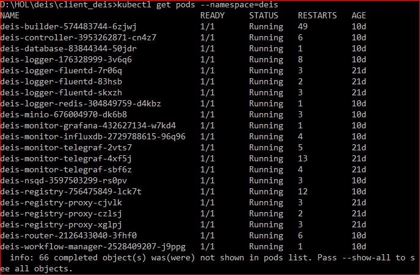

`kubectl port-forward deis-monitor-grafana-432627134-w7kd4 3500:3500 --namespace=deis`

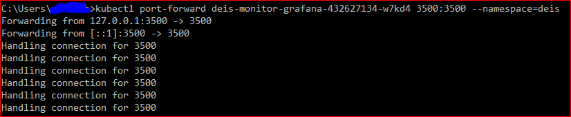

### **Dashboards**

Home dashboard

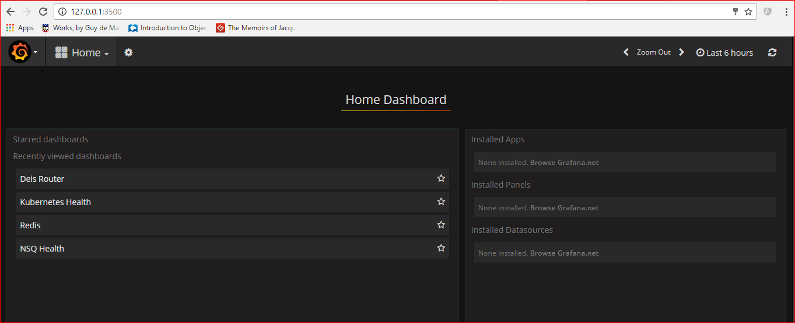

`deis router dashboard`

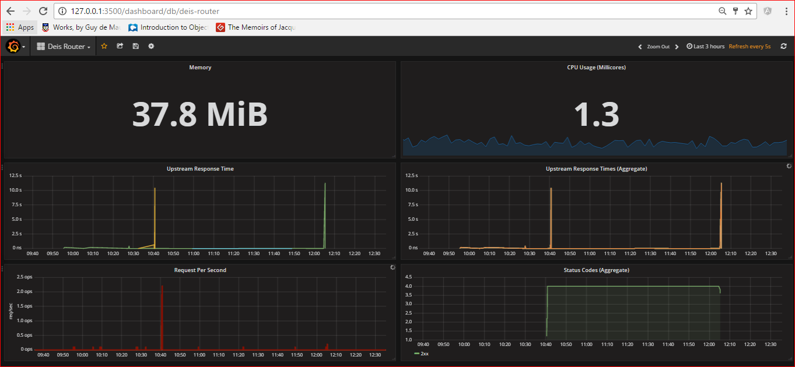

## Conclusion

This document covers the steps to implement Deis-Workflow on the
Kubernetes infrastructure using “helm” the medium of installation. The
steps to deploy an application over the Deis-Workflow from Docker image
stored in private registry is also illustrated.
